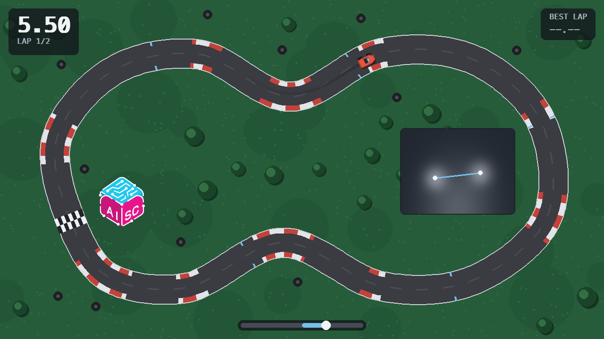
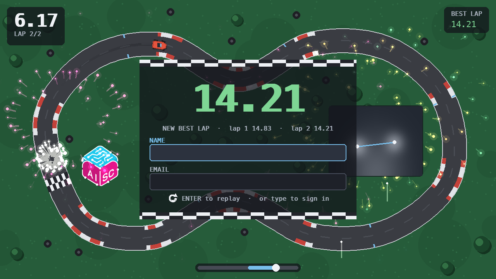
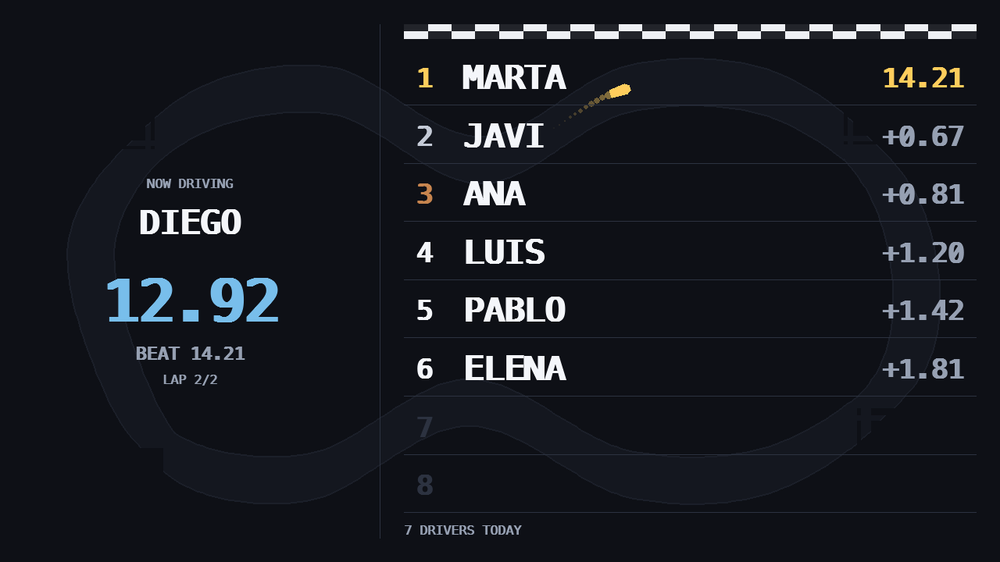

# 🏎️ Hand-Wheel Racer

**Grab a cardboard rectangle. Pretend it's a steering wheel. Drive.**

That's it. That's the game. A webcam watches your two wrists, the tilt of the
line between them steers a little red car around a circuit, and thirty seconds
later you find out whether you're better at imaginary driving than everyone
else at the stand.

Built for the AI Student Collective (AISC) Madrid tabling booth, where the hard
part isn't the computer vision — it's getting a shy person walking past to try
something in front of a queue.



## How it works

You hold a physical bar with both hands. MediaPipe finds your wrists. The angle
between them is your steering wheel.

- **No throttle, no brake.** Both your hands are busy holding the bar, so the
  car drives itself. All you do is point it.
- **Two laps.** About thirty seconds. The queue moves.
- **Grass is the only punishment.** Leave the tarmac and you slow down. That's
  the entire skill: draw a clean line. You can't spin, you can't crash, and you
  can't get stuck — which matters, because spinning out in front of strangers is
  exactly the thing that stops people having a go.
- **No calibration, no buttons.** Pick up the bar, hold it level, and the
  countdown starts.

Beat your own best and the screen throws confetti at you:



## The second screen

The laptop runs the game. A monitor facing the stand runs a **timing tower** —
who's driving right now, the record, and how badly everyone is losing to it.



It's a web page now, not a second window, and that's the interesting part: it
is the *same* page anyone in the room gets by scanning the QR code on the
table. One design to keep good instead of two, and what the stand is
advertising is exactly what the room can see. On a monitor it lays itself out
as the tower; on a phone it's a list.

The laptop serves that page itself, from a copy of the last board the server
sent. So when the venue's wifi goes away for twenty minutes — and it will —
the biggest thing at the stand keeps showing a board instead of an error.

## Play it

Needs Python 3.12.

```bash
uv sync --extra cv        # the webcam stack
uv run python run.py
```

That opens the game and starts the station behind it, which prints a URL.
Open that in a browser, drag it onto the monitor facing the stand, press
**F11**, and you're a racing team.

To put the times somewhere the room can see them, write a `.env` at the top of
the repository:

```
WHEEL_RACER_SERVER=https://racer.example.com
WHEEL_RACER_BOOTH_TOKEN=the-token-from-the-server
```

Without it everything still works — the game plays, the board shows the stand's
own results, and finished runs queue on disk until there is somewhere to send
them. See [`server/README.md`](server/README.md) for the other half.

No webcam handy? No problem:

```bash
uv sync                   # skip MediaPipe entirely
uv run python run.py --input keyboard
```

Arrow keys steer, space starts. The whole game runs end to end without a camera,
which is how most of it got built.

### Keys

| | |
|---|---|
| **F11** or **Cmd-F** | fullscreen, on either window |
| **Esc** | quit |
| **Tab / Enter** | move through the sign-in form |
| **← →** or **A / D** | steer, in keyboard mode |

## What's in here

```
run.py                 start the stand (game + leaderboard)
leaderboard.py         the second screen, on its own
src/wheel_racer/
  car.py               arcade physics: auto-throttle, grass, no drift
  track.py             centreline + width → on-track? how far round?
  track_data.py        the circuit itself, as a handful of control points
  laptimer.py          ordered-checkpoint validation, so times are real
  camera.py            OpenCV + MediaPipe → two wrist points
  steering.py          two wrists → one number in [-1, +1]
  render.py            the game screen
  results.py           where a finished run goes
  live.py              the file the game and the station talk through
  station/             the booth's link to the server: queue, cache, kiosk

web/index.html         the board, for the stand's monitor and everyone's phone
server/                the API and the database behind it
```


## Tests

```bash
uv run --extra dev pytest
```

Around 475 of them, all green, and none need a webcam.

## A note on the data

The booth collects names and email addresses. Nobody drives without ticking a
box that says so, and what they agreed to — and when — is filed with every run.

The board shows **first names only**, and two people called Marta are told
apart by an initial rather than by a surname: a screen at a public stand that
strangers can photograph is the last place anyone's contact details belong.

`data/` on the laptop is gitignored and stays that way. It holds the queue of
runs waiting to be sent and a small roster of who has played here today, so
that a second go five minutes later still knows what you have to beat.

---

<sub>Made for AISC Madrid · steering wheel not included, cardboard sold
separately</sub>
